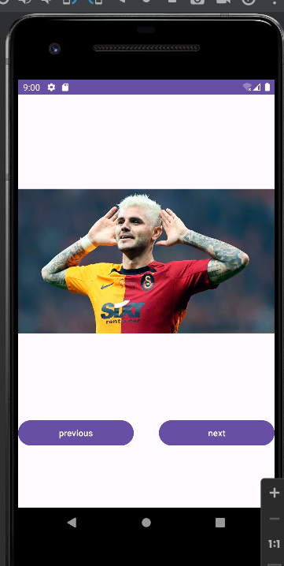

# Android Image Switcher

## Description
This Android application demonstrates an image switcher with previous and next buttons, allowing users to seamlessly navigate through a collection of images. The app provides an intuitive interface for an enhanced viewing experience.

## Screenshots
imageSwitcher1.png

## Features:
- Image switcher functionality
- Previous and Next buttons for navigating through images
- Simple and user-friendly interface
  
## Technologies/Libraries Used:
Android Studio
Java/Kotlin
Android ImageSwitcher widget

## Installation Instructions:
Clone the repository
Open the project in Android Studio
Build and run the app on an emulator or a physical device
Usage
Once the app is running:

Use the 'Previous' and 'Next' buttons to navigate between images.
Experience the smooth transition between images within the app's image switcher.
